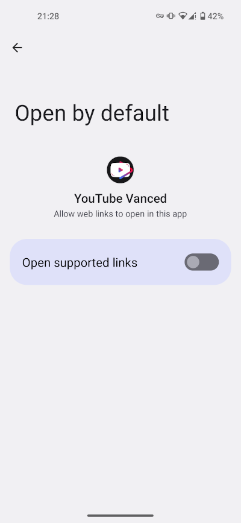
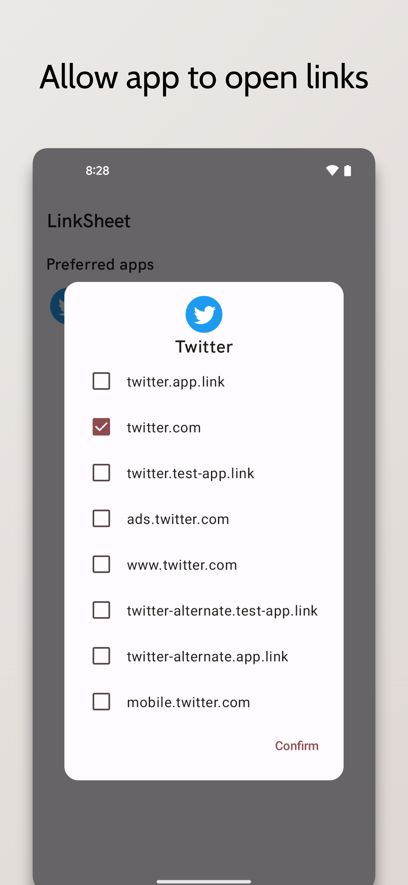
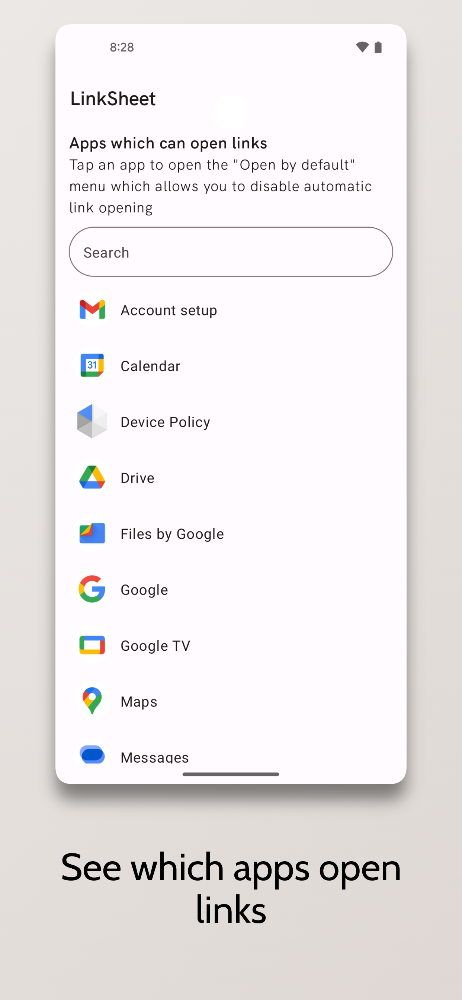

# LinkSheet

<!-- ---------- Badges ---------- -->

<!-- ---------- Download ---------- -->

<!-- ---------- Description ---------- -->

LinkSheet restores the Url-App-Chooser that was removed in Android 12.

<!-- ---------- Screenshots ---------- -->

  
  
  
  
  

 

## Donations

<a href="https://coindrop.to/fexd" target="_blank"></img></a>

## Acknowledgements

Code was taken from:

* [OpenLinkWith](https://github.com/tasomaniac/OpenLinkWith)
* [Seal](https://github.com/JunkFood02/Seal)

