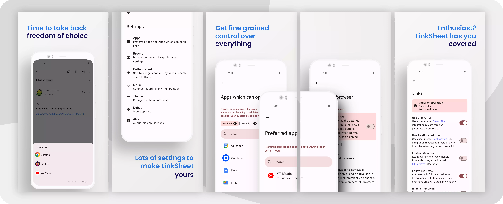

# LinkSheet

<!-- ---------- Badges ---------- -->

<!-- ---------- Download ---------- -->

<!-- ---------- Description ---------- -->

LinkSheet restores the Url-App-Chooser that was removed in Android 12+ in favor of [verified app links](https://developer.android.com/training/app-links/verify-android-applinks).

<!-- ---------- Screenshots ---------- -->

  

 

    
    

## Features

* Set preferred browser: Always list all browsers, only list native apps, always list selected browser, only list whitelisted browsers 
* Preferred app for host: Set app to always open for selected host
* List apps which have verified links so you can easily disable them to allow LinkSheet to work
* Include usage stats and "last app used history" in sorting algorithm
* Copy url button in bottom sheet which copies the current url to the clipboard
* Share To button in bottom sheet which sends a "Share To" intent to other apps
* Single tap: Only require a single tap in bottom sheet to open app
* Always show package name: Shows package names all throughout the application
* Disable toast: Disables all toast messages
* Display apps in grid instead of list
* Resolve redirects either locally or via API hosted @ supabase.com ([Supabase Privacy policy](https://supabase.com/privacy)), API itself does not log anything except timestamp
* *Experimental:* [ClearURLs](https://github.com/ClearURLs) integration (removes tracking parameters) (report issues/bugs [here](https://github.com/1fexd/clearurlkt))
* *Experimental:* [FastFoward](https://github.com/FastForwardTeam/FastForward) **rule** integration (extracts redirects from url parameters) (report issues/bugs [here](https://github.com/1fexd/fastforwardkt))
* *Experimental:* [LibRedirect](https://github.com/libredirect/libredirect) integration (redirects to non-proprietary frontends) (report issues/bugs [here](https://github.com/1fexd/libredirectkt))

## Donations / LinkSheet Pro

All donations of 5€+ are eligible for LinkSheet Pro. Currently, the only benefit Pro provides is hiding the donation banner within the app. In the future, I may implement some Pro-only features, but these will be new features. Existing features will not be paywalled.

Want to donate in another way (Bank Transfer/Paypal etc., or another crypto)? Send a mail to `grrfe[at]420blaze.it`

## Nightly builds

Github automatically builds a "nightly" version of LinkSheet on push (e.g. meaning one or more commits have occurred). The latest nightly version can always be downloaded via [nightly.link](https://nightly.link/1fexd/LinkSheet/workflows/build-nightly/master/linksheet-nightly.zip), but if you are using something like [Obtainium](https://github.com/ImranR98/Obtainium), there also is a [LinkSheetNightly](https://github.com/1fexd/LinkSheetNightly) repository where nightly builds are released as Github releases.

## Note

This is a hobby project, and since I have many of those, I sometimes choose to ignore issues or postpone working on them as I am either not motivated or don't have any time (since I also have a job). LinkSheet is feature-complete for my use-case, so everything I add/change is because someone requested it. I have made less than 2€ from donations and there is no incentive other than providing a solid app for this project. Please take that into consideration before opening an issue. If you would **really** like a new feature added or a bug fixed, send me an email and we can talk about a small donation in exchange for the immediate start of development. 

⚠️ Development is a bit stale at the moment, as I am busy with other things and/or don't have that much motivation. If you encounter bugs or issues, try using the latest nightly build, it might have already been fixed there.

## License

* LinkSheet, excluding all `strings.xml` and `plural.xml` files, is licensed under the [FXL](LICENSE)
* All `strings.xml` and `plural.xml` files are licensed under [GPL-3.0](LICENSE_STRINGS)

## Acknowledgements

* App was initially based on [OpenLinkWith](https://github.com/tasomaniac/OpenLinkWith)
* [Seal](https://github.com/JunkFood02/Seal) has been a reference to learn from

## Star History

